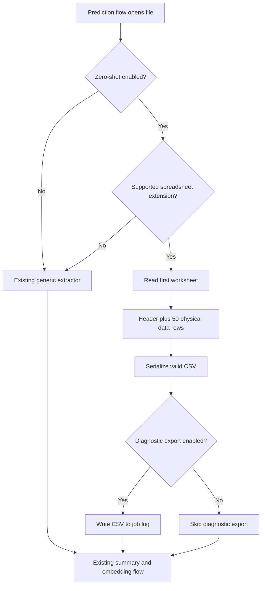

# Solution Design Document

## Reco Excel Preview CSV for Embedding

**Author:** Shaun Zhang / Copilot draft  
**Date:** 2026-08-14

---

## Table of Contents

- [Basic Info](#basic-info)
- [What](#what)
- [How](#how)
- [Solution Diagram](#solution-diagram)
- [Major Points](#major-points)
  - [Security](#security)
  - [Performance](#performance)
  - [Cost](#cost)
- [Notes from Review](#notes-from-review)

---

## Basic Info

| Item | Description |
|---|---|
| Feature Name | Excel preview CSV for embedding |
| Reviewer | TBD |
| QA Owner | Mica Li |
| Feature Jira | [RECO-36969](https://avepoint.atlassian.net/browse/RECO-36969) |
| Architect Review Jira | TBD |
| Primary Dev / Author | Shaun Zhang |
| Architects / Reviewers | TBD |
| Architecture Review Meeting | TBD |

---

## What

This feature changes how spreadsheet files are prepared for the Reco embedding and prediction flow.

The current business path can send a large or weakly structured text extraction to the embedding model. This may lose the relationship between column headers and row values. The new path creates a small CSV preview so the model receives a stable table structure.

The feature is currently connected only to the zero-shot prediction flow. It does not replace generic extraction for other prediction modes or for unsupported file types.

Expected outcomes:

- Preserve spreadsheet headers and row context in embedding input.
- Read only the first worksheet and the first 50 physical data rows.
- Produce valid CSV that can be inspected and used by downstream processing.
- Reduce work and memory use compared with extracting the full workbook.
- Keep existing generic extraction behavior outside the enabled business path.

---

## How

### Overall flow

1. The prediction flow opens the source file and checks its file name extension.
2. For supported spreadsheet extensions, and only when zero-shot prediction is enabled, it uses the preview path.
3. The preview reader reads the first worksheet only.
4. The first physical row is treated as the header. The next 50 physical rows are included as preview data.
5. Empty rows and empty header cells within the detected table width are preserved.
6. The result is serialized as UTF-8 CSV with comma separators and CRLF row endings.
7. The CSV becomes the extracted content passed to the existing summary and embedding stages.
8. When full-document embedding is disabled, the existing summary step still runs on this CSV content.

### Supported file types

The preview path accepts:

- `.xlsx`
- `.xls`
- `.xlsm`
- `.xlsb`
- `.xltx`
- `.xlt`
- `.ods`

Selection is based on the file name extension. The content is not sniffed to select another reader, and an extension/content mismatch is treated as a parsing failure.

### Output behavior

The output is pure CSV. It does not contain worksheet names, file metadata, or explanatory text.

The header width ends at the last non-empty header cell. Values beyond that width are not included. Missing cells are emitted as empty CSV fields. Values containing commas, quotes, or line breaks are escaped according to standard CSV rules.

The preview limit is 50 physical data rows, not 50 non-empty rows. Empty rows therefore remain part of the preview. Spreadsheet repeat-row metadata is expanded only up to the preview limit.

The reusable utility supports an optional maximum character count and truncates only before a complete row. The current business caller uses the default unlimited value, so the active business bound is the 51-row preview rather than a 1,000,000-character limit.

### Business integration

The preview path is selected when both conditions are true:

- Zero-shot prediction is enabled.
- The file extension is supported by the preview reader.

All other files continue through the existing generic extractor. A separate configuration flag controls whether the generated CSV is written to the job log for diagnosis. That export is optional and is not required for embedding.

The extraction operation runs inside the existing file-content timeout and logging boundary. If preview parsing fails, the existing error handling records the failure and marks content retrieval as unsuccessful; it does not silently return an empty successful result.

### API design

No external product API is added or changed.

| Interface | Purpose | Input | Output | Change type |
|---|---|---|---|---|
| Internal spreadsheet preview capability | Convert a supported workbook stream into preview CSV | Readable, seekable file stream; file name; optional character limit | CSV text or an explicit parsing/argument error | New internal capability |
| Internal support check | Decide whether the preview path can handle a file name | File name | Support decision | New internal capability |

### Database and storage changes

No database schema changes are required. A new key-value configuration entry is added to the existing configuration table to control diagnostic CSV export.

The optional diagnostic CSV is written to the existing prediction job log folder. It is controlled by configuration, uses the item identifier in the file name, and is not part of the embedding data contract.

Add the new configuration entry with:

```sql
Insert into [SchemaDBName].[RMKeyValues] Values('EnableExportExcelPreviewCsv','true');
```

The value `true` enables diagnostic CSV export. This setting does not enable the Excel preview embedding path itself.

### Dependencies and configuration

The feature reuses the existing spreadsheet reading dependency for Excel-family formats and a lightweight package-content reader for ODS files. It depends on the existing prediction, summary, embedding, timeout, and logging flows.

The business behavior is gated by the existing zero-shot setting. Diagnostic CSV export is controlled separately and defaults to disabled when the setting is absent or false.

### Rollout and compatibility

Roll out the preview behavior with zero-shot prediction enabled for the target scope. Monitor extraction failures, embedding input quality, processing time, and memory use.

No data migration is needed. Disabling zero-shot prediction or removing the preview selection returns the affected files to the existing generic extraction path.

### QA validation suggestions

- Verify all seven supported extensions with valid files.
- Verify that unsupported extensions use generic extraction and do not enter the preview path.
- Verify that only the first worksheet is used.
- Verify header handling, including empty header cells and values beyond the last non-empty header.
- Verify exactly 50 physical data rows, including preserved empty rows.
- Verify CSV escaping for commas, quotes, carriage returns, line breaks, and empty values.
- Verify an empty first worksheet does not use data from a later worksheet.
- Verify extension/content mismatch, damaged files, password-protected files, unreadable streams, and invalid arguments produce failures.
- Verify the zero-shot and non-zero-shot paths select the expected extractor.
- Verify the optional diagnostic export does not affect embedding when disabled.
- Verify the summary step receives the CSV content when full-document embedding is disabled.
- Verify timeout and error logs contain enough information to diagnose a failed file without exposing file content.

---

## Solution Diagram



---

## Major Points

### Security

This is an internal processing change and adds no public endpoint. The reader must not execute workbook content or external references. Malformed, encrypted, unsupported, or unreadable files must surface as processing failures rather than produce misleading content.

Diagnostic export must remain configuration-controlled and must use existing job-log access controls. Logs should record identifiers and failure details, not spreadsheet cell content.

### Performance

The reader limits worksheet selection and row materialization to a small preview. ODS repeated rows are bounded during expansion, and Excel-family files use a lightweight reading mode.

The active business path does not apply a character cap by default. Very wide cells or large cell values can therefore still create a large CSV within the 51-row limit. Performance testing should include wide columns, long text, sparse rows, repeated ODS rows, and large workbooks.

### Cost

The preview reduces downstream embedding input for workbooks with many rows. The benefit is strongest when the source workbook is large and the first worksheet provides representative headers and sample data.

The preview is intentionally not a full-workbook representation. Files whose meaning depends on later worksheets or distant rows may lose information and should be monitored through prediction quality metrics.

---

## Notes from Review

- The business integration is conditional, not a standalone public API.
- The active business caller uses the default unlimited character value; the documented contract must not claim a 1,000,000-character default.
- The preview contains the first worksheet, its detected header, and up to 50 physical data rows.
- CSV output contains no worksheet name or metadata.
- Truncation, when a caller supplies a character limit, occurs only at complete row boundaries.
- The optional CSV file export is for diagnosis and does not control whether embedding uses the preview.
- Existing generic extraction remains the compatibility path for unsupported files and non-zero-shot prediction.
- Architecture review, Jira, reviewer, and QA ownership are still pending business confirmation.
