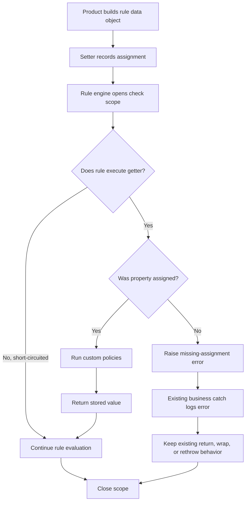

# Solution Design Document

## Records ObjectInfo Property Assignment Guard

**Author:** Vince Wu / Copilot draft  
**Date:** 2026-08-21

---

## Table of Contents

- [Basic Info](#basic-info)
- [What](#what)
- [How](#how)
- [Solution Diagram](#solution-diagram)
- [Major Points](#major-points)
  - [Security](#security)
  - [Performance](#performance)
  - [Cost](#cost)
- [Notes from Review](#notes-from-review)

---

## Basic Info

| Item | Description |
|---|---|
| Feature Name | ObjectInfo Property Assignment Guard |
| Reviewer | Vince Wu |
| QA Owner | TBD |
| Feature Jira | [RECO-42023](https://avepoint.atlassian.net/browse/RECO-42023) |
| Architect Review Jira | TBD |
| Primary Dev / Author | Vince Wu |
| Architects / Reviewers | Vince Wu |
| Architecture Review Meeting | TBD |

---

## What

Rule data objects are intentionally populated with only the properties required by the active policies. Previously, reading a property that was never populated returned its CLR default value. A rule could therefore produce an incorrect archive, retention, disposal, search, or classification result without showing that required data was missing.

This feature adds assignment validation to the .NET 10 rule data objects. During rule evaluation, every property getter that is actually executed verifies that its setter was called. A missing assignment raises a dedicated error with the runtime object type and property name. Reads outside rule evaluation keep their previous behavior.

Expected outcomes:

- Detect incomplete rule data at the point where a rule reads it.
- Treat explicit `null`, empty string, `false`, zero, enum defaults, and other CLR defaults as valid assignments.
- Preserve language short-circuit behavior. A skipped expression operand does not require its property.
- Preserve existing qualified and not-qualified results when all required properties are assigned.
- Add actionable logs at existing business exception boundaries.
- Cover the complete .NET 10 ObjectInfo property hierarchy with an automated contract test.
- Keep public property names, types, and normal property access syntax unchanged.

The implemented scope includes the signed .NET 10 common utility library, 256 guarded properties, rule-engine activation, affected product logging paths, a focused test project, and a performance benchmark. The separate `NewWrapperCommon` implementation and unrelated workspace changes are outside this scope.

---

## How

### Overall flow

1. A product data builder creates a rule data object and assigns the properties needed by its active policies.
2. Each setter stores the value and records that the property was assigned. Assignment state is separate from the stored value.
3. The common rule engine opens a scoped property check before evaluating policies.
4. When a rule executes a getter, the fixed assignment policy runs first.
5. If the property was never assigned, the getter raises a dedicated error containing the runtime object type and property name.
6. If the property was assigned, any registered custom policies run in registration order and the getter returns the stored value.
7. Normal `AND` and `OR` short-circuiting determines which getters run.
8. The scope is restored after success or failure. Nested scopes keep checking active until the outer scope ends.

Assignment state is retained for the lifetime of the data object. Reassigning a property updates its value while keeping it marked as assigned.

### Property coverage and compatibility

All 256 public read/write properties in the target hierarchy use the same intercepted getter and setter behavior. Compiler-generated backing storage replaces the previous explicit property fields. A reflection-based contract test verifies that every current and future descendant property is independently backed and intercepted.

The duplicate `Name` properties on the file-system file and folder data objects were removed. Both types now reuse the inherited common `Name` property. The public property remains available to callers.

The following items are intentionally not converted:

- Public fields on the tree-node data object.
- Auto-properties on the non-descendant member data object.
- Internal guard state.
- The separate .NET Framework wrapper implementation.

Public property names and types remain unchanged. No serialization attributes were added or removed. Consumers that depend on private backing-field names are not part of the supported contract and require separate compatibility testing.

### API design

No external REST, service, or message contract is added or changed. The feature adds the following in-process library contracts:

| Interface | Purpose | Input | Output / behavior | Change type |
|---|---|---|---|---|
| Property check scope | Enable assignment checks for one data object | Target rule data object | Disposable scope; nested use is supported | New public library capability |
| Custom property policy registration | Add or remove optional checks | Policy instance | Duplicate instances are ignored; removal reports success | New public library capability |
| Property check policy | Apply a custom rule to an executed getter | Immutable check context | Completes normally or throws an error | New public library contract |
| Property check context | Supply policy inputs | Target, property name, property value | Immutable assignment state and property data | New public library data contract |
| Missing-assignment error | Report an executed but unassigned property | Runtime object type and property name | Dedicated invalid-operation error | New public library exception |

The fixed assignment policy is always installed and cannot be removed. Null policies, null targets, and empty property names are rejected.

### Exception and logging behavior

The dedicated missing-assignment error is preserved through the internal reflection path so the common engine can identify the original property failure.

At business entry points that already catch general exceptions, the new behavior records the full missing-assignment exception and then keeps that entry point's existing control flow. Depending on the product path, the existing behavior may return a not-qualified result, wrap and throw a general error, or rethrow the original error. No additional dedicated throw is introduced inside those broad catches.

Logging was added or updated for these product areas:

- Box
- Advanced search
- File system
- Exchange
- Google Drive
- Physical records
- Azure File Share
- Custom connectors
- SharePoint
- Teams

The diagnostic message identifies the failed operation and records the exception details. It does not add property values to the log.

### Tests and development validation

A new .NET 10 xUnit project is registered in the solution's unit-test folder. Its 22 tests cover:

- Disabled checks and unchanged default reads.
- Missing-assignment errors and diagnostic fields.
- Explicit CLR-default assignments.
- Fixed and custom policy ordering.
- Duplicate policy suppression and policy removal.
- Nested scopes and restoration after exceptions.
- Repeated assignment and case-sensitive property tracking.
- Immutable policy context and invalid arguments.
- Every public read/write property in the inheritance tree.
- Inherited property behavior and runtime subtype reporting.
- Assigned rule outcomes, short-circuiting, reflection paths, and existing broad-catch results.

A separate BenchmarkDotNet project measures disabled and enabled getter paths. The latest ShortRun result recorded during development was:

| Scenario | Allocation |
|---|---:|
| Checking disabled | 0 B per operation |
| Checking enabled | 48 B per operation |

The focused test suite passed 22 of 22 tests. Debug and Release builds of the target library completed with zero errors. The full `RAOnline.DEV.sln` build also completed with zero errors; existing repository warnings remain.

### Database, storage, and configuration

No database schema, stored data, file format, application setting, background job, authorization rule, network call, retry, or timeout behavior is changed.

The test project adds xUnit and test SDK development dependencies. The benchmark project adds BenchmarkDotNet and is kept outside the product solution build.

### Rollout and compatibility

No data migration or feature configuration is required. The guard becomes active automatically only while the common rule engine evaluates an ObjectInfo instance. Ordinary reads outside that scope remain unchecked.

Deployment requires the updated .NET 10 common utility assembly and rebuilt dependent product components. The .NET Framework wrapper remains unchanged and must not be assumed to have this behavior.

During rollout, monitor missing-assignment logs by product area. Each log identifies a DTO type and property that its data builder must populate when the related policy is active.

### QA validation suggestions

- Verify representative assigned rules for every supported product area keep their existing result.
- Execute a rule whose required property is not populated and verify the logged object type and property name.
- Assign `null`, empty string, `false`, zero, enum defaults, and default dates and verify they are accepted.
- Verify `AND` and `OR` expressions check only getters that are actually executed.
- Verify checking ends after both successful and failed evaluations.
- Verify nested checks remain active until the outer scope ends.
- Verify each affected business boundary keeps its existing return, wrap, or rethrow behavior and adds the expected error log.
- Verify file-system file and folder names still serialize and evaluate through the inherited property.
- Verify public property names and types remain compatible with existing DTO builders and serializers.
- Verify a future ObjectInfo property that bypasses interception fails the reflection contract test.
- Run load tests for rules that read many properties or install custom policies.
- Confirm the separate .NET Framework wrapper retains its previous behavior.

---

## Solution Diagram

---

## Major Points

### Security

This is an in-process validation feature. It adds no authentication or authorization boundary and does not call an external service.

The new logs contain exception details, object type, and property name. They do not intentionally include the property value. Existing log access controls and retention rules continue to apply.

Custom policies execute inside the calling process and should be treated as trusted library extensions. They must not read intercepted properties from the same target while validating that target, because recursive reads are not prevented by the framework.

### Performance

The disabled path checks the scope state and returns the stored value without creating a context or iterating policies. The development benchmark recorded zero allocation for this path.

The enabled path creates one immutable context for each executed getter, checks assignment state, and runs registered custom policies. The recorded benchmark allocated 48 bytes per getter. Rule paths with many getter reads or custom policies should be included in performance regression testing.

The same data object is not designed for concurrent rule evaluation or mutation across threads.

### Cost

No infrastructure, database, storage, or external-service cost is added. Runtime cost is limited to CPU and small per-getter allocations while assignment checking is enabled.

Earlier detection may reduce the operational cost of investigating incorrect archive, retention, disposal, search, or classification results caused by incomplete DTO population.

---

## Notes from Review

- The latest requirement keeps existing broad exception handling. Those paths log a missing-assignment error but do not add a separate dedicated throw.
- As a result, not every product boundary exposes the dedicated exception type to its caller. This is an intentional compatibility choice and a diagnostic limitation.
- The fixed assignment policy runs before custom policies and cannot be removed.
- Explicit CLR-default values count as assigned because setter execution, not value comparison, defines assignment.
- Only getters reached by normal expression evaluation are checked.
- Assignment state lasts for the object lifetime; check enablement lasts only for the active scope.
- The public DTO property surface is preserved, but private backing-field names changed and are not a supported serialization contract.
- The benchmark result is a development ShortRun measurement, not a production service-level target.
- QA ownership, architecture review Jira, and architecture review meeting remain to be confirmed.
